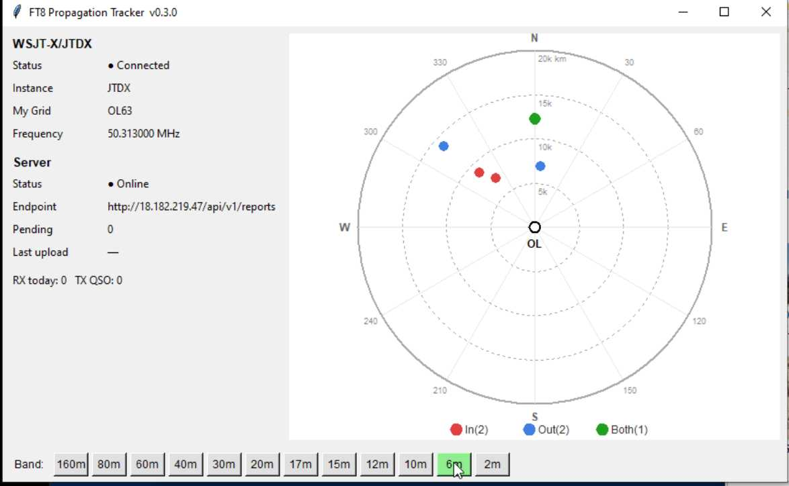

# FT8 Propagation Tracker

**Language / 语言 / 言語 / Sprache / Idioma / Язык / Langue / Idioma:**
[English](#en) | [中文](#zh) | [日本語](#ja) | [Deutsch](#de) | [Español](#es) | [Русский](#ru) | [Français](#fr) | [Português](#pt)

---

<a id="en"></a>

# English

## What is this project?

**FT8 Propagation Tracker** is a propagation observation tool for amateur radio operators. It runs as a background companion to **WSJT-X / JTDX**, listening to their UDP packets, automatically extracting propagation data from decoded signals (RX) and completed QSOs (TX), and **anonymously reporting** them to a server. This aggregated data shows "who is hearing whom, on which band, at what time, from where to where" — especially useful for monitoring **6 m** and other propagation-dependent bands.

- **Client**: single file, zero external dependencies, supports both GUI and CLI, runs alongside WSJT-X/JTDX.



---

### What is GridCodec?

The client source is distributed with **GridCodec** — a **Maidenhead grid propagation matrix binary codec** used to efficiently broadcast "who-hears-whom" data.

- **The problem**: all 4-character grids produce 32,400 grid squares; a raw adjacency matrix would be ~**125 MB** — impractical to push to many clients.
- **The approach**: a hierarchical dimensional projection algorithm exploits the **geographic sparsity** of propagation, compressing typical FT8 activity to roughly **2–20 KB** (compression ratios of 10,000× or more).
- **Role in the project**: the server **encodes** the propagation matrix with GridCodec and pushes it to clients; clients **decode** it for the radar/map view. That is why GridCodec ships together with the client source.
- **Implementations**: the same wire format (v1) is available in **C (reference), Python, MicroPython, JavaScript, and Java**, all cross-compatible. Standalone repo: [github.com/bg7nzl/gridcodec](https://github.com/bg7nzl/gridcodec); bundled docs: [README-CN.md](gridcodec/README-CN.md).

---

### Privacy

Only the **minimum propagation-related data** is reported — nothing that could identify you or your station:

| Reported | Not reported |
|----------|--------------|
| 4-char Maidenhead Grid (e.g. `PM01`), frequency, time, type (RX/TX) | Callsign, SNR, mode, message content |

The server only knows "some grid heard another grid on some frequency at some time." It **never** knows your callsign and cannot derive it.

---

### Windows client download (exe)

If you are on Windows and don't want to install Python, download the pre-built single-file exe:

- **Download**: [ft8_tracker_client.exe](https://github.com/bg7nzl/proptracker-client/releases/latest/download/ft8_tracker_client.exe) ([release page](https://github.com/bg7nzl/proptracker-client/releases/latest))

---

### How to run (Windows exe — no command-line skills needed)

The instructions below use the **exe**. You don't need to open a command prompt — just create a "batch file" and double-click it.

#### Step 1 — Download and place the exe

1. Download [ft8_tracker_client.exe](https://github.com/bg7nzl/proptracker-client/releases/latest/download/ft8_tracker_client.exe).
2. Put it in an easy-to-find folder (e.g. `D:\FT8Tracker`), not buried on the desktop.

#### Step 2 — Create a batch file to launch it

A batch file is a text file with the **`.bat`** extension. Double-clicking it runs the command inside.

1. In the **same folder** as the exe, right-click → **New** → **Text Document**.
2. Rename it to e.g. `Start_PropTracker.bat` (any name, but the extension **must be `.bat`**).
   - If Windows hides extensions: open any folder → **View** → check **File name extensions**, then rename.
3. Right-click the `.bat` → **Edit** (or open with Notepad), paste one of the examples below, save and close.

From now on, **double-click the .bat** to start.

#### Example 1 — This client only (unicast)

First set WSJT-X/JTDX UDP to 127.0.0.1 port 2237 (see "Option A" below).
In the .bat write:

```bat
ft8_tracker_client.exe --unicast --udp-ip 127.0.0.1 --udp-port 2237
```

The GUI opens and the status bar shows **Unicast 127.0.0.1:2237**.

#### Example 2 — Together with GridTracker (multicast)

First set WSJT-X/JTDX and GridTracker to multicast 224.0.0.73 port 2237 (see "Option B" below).
In the .bat write:

```bat
ft8_tracker_client.exe --multicast --udp-ip 224.0.0.73 --udp-port 2237
```

The GUI opens and shows **Multicast 224.0.0.73:2237**.

#### Example 3 — Headless / background

No window, suitable for always-on operation. In the .bat:

```bat
ft8_tracker_client.exe --cli --multicast --udp-ip 224.0.0.73 --udp-port 2237
```

For unicast headless:

```bat
ft8_tracker_client.exe --cli --unicast --udp-ip 127.0.0.1 --udp-port 2237
```

#### Example 4 — Double-click without arguments

You can also just write:

```bat
ft8_tracker_client.exe
```

The GUI starts in **unicast 127.0.0.1:2237** by default. A **"Switch to multicast"** button in the lower-left lets you switch on the fly.
**Beginners should prefer Example 1 or 2 with explicit arguments to avoid mistakes.**

---

**Note:** `--unicast` or `--multicast` must be accompanied by **both** `--udp-ip` and `--udp-port` — omitting any one will produce an error.
All examples assume the exe is named `ft8_tracker_client.exe` and the .bat is in the **same folder**.

---

### Default UDP conflict with other software

WSJT-X / JTDX by default sends decoded data to **one** UDP destination (usually **127.0.0.1:2237**). On the same machine, only one program can bind that port, so:

- Running **this client alone** — no problem.
- Running **GridTracker, JTAlert**, etc. at the same time — only one will receive data; the others get a port-in-use error or no data at all.

This is not caused by this client but by the "single-target UDP" default of WSJT-X/JTDX. To use **multiple programs simultaneously**, switch to a **multicast** address so all programs receive the same stream.

---

### How to set up

#### Option A — This client only (unicast, default)

1. Open **WSJT-X** or **JTDX**.
2. Go to **Settings → Reporting**.
3. Check **Accept UDP requests**.
4. Set **UDP Server**:
   - Address: `127.0.0.1`
   - Port: `2237`
5. Run this client with defaults (unicast).

#### Option B — Alongside GridTracker, etc. (multicast)

Have WSJT-X/JTDX send to a **multicast address** so every client receives the same data.

**1. In WSJT-X or JTDX:**

- **Settings → Reporting**
- Check **Accept UDP requests**
- Set **UDP Server**:
  - Address: `224.0.0.73` (multicast — do **not** use 127.0.0.1)
  - Port: `2237`
- Save

**2. In this client:**

- **GUI**: click **"Switch to multicast"** and follow the dialog.
- **CLI**: add `--multicast` (if locking mode, also supply `--udp-ip` and `--udp-port`).

**3. In GridTracker:**

- **Settings** → find **Receive UDP** or equivalent
- Select **multicast**, enter:
  - IP: `224.0.0.73`
  - Port: `2237`

**4. Other WSJT-X-compatible software (JTAlert, etc.):**

- Change the UDP receive address to multicast `224.0.0.73` port `2237`.

After this, WSJT-X/JTDX sends one stream to 224.0.0.73:2237, and all programs receive it simultaneously without conflict.

[Back to top / 返回顶部](#ft8-propagation-tracker)

---
---

<a id="zh"></a>

# 中文

## 项目是做什么的

**FT8 Propagation Tracker** 是一个面向业余无线电爱好者的传播观测工具。它以后台"外挂"的方式监听 **WSJT-X / JTDX** 的 UDP 报文，自动提取解码（RX）和已完成的 QSO（TX）中的传播信息，**匿名上报**到服务器，用于汇聚"谁在什么频率、什么时间、从哪到哪"的链路开通情况，尤其方便查看 **6m 等频段**的传播状况。

- **客户端**：单文件、零额外依赖，支持 GUI 和 CLI，可与 WSJT-X/JTDX 同时运行。


---

### 随附的 GridCodec 是什么

客户端源码会与 **GridCodec** 一起发布。GridCodec 是本项目使用的 **Maidenhead 网格传播矩阵二进制编解码器**，用来高效广播"谁到谁有传播"的数据。

- **要解决的问题**：全 4 字网格有 32,400 个格点，原始邻接矩阵约 **125 MB**，向大量客户端广播不现实。
- **做法**：用分层维度投影算法利用传播的**地理稀疏性**，把典型 FT8 活动压缩到 **约 2–20 KB**（压缩比可达万倍以上），方便服务器推送、客户端接收。
- **在项目里的角色**：服务端用 GridCodec **编码**传播矩阵后下发给客户端；客户端的雷达/地图视图用 GridCodec **解码**并展示。因此发布客户端源码时会一并带上 GridCodec，便于编译和运行。
- **实现**：同一套线格式（v1）提供 **C（参考）、Python、MicroPython、JavaScript、Java** 等实现，可交叉编解码。独立仓库：[github.com/bg7nzl/gridcodec](https://github.com/bg7nzl/gridcodec)；本包内文档见 [README-CN.md](gridcodec/README-CN.md)。

---

### 隐私如何保护

上报的数据**只包含传播相关的最小信息**，不包含任何可识别个人或电台身份的字段：

| 上报内容 | 说明 |
|----------|------|
| **有** | 四字 Maidenhead Grid（如 `PM01`）、频率、时间、类型（RX/TX） |
| **无** | 呼号、信号强度(SNR)、模式、具体消息内容 |

也就是说：服务器只知道"某个 grid 在某个频率、某个时间与另一个 grid 有传播"，**不知道是哪个呼号**，也无法反推你的呼号。所有上报都是匿名、仅基于 grid 的。

---

### Windows 客户端下载（exe）

若你使用 Windows 且不想安装 Python，可直接下载打包好的单文件 exe：

- **下载地址**：[点击下载 ft8_tracker_client.exe](https://github.com/bg7nzl/proptracker-client/releases/latest/download/ft8_tracker_client.exe)（[发布页](https://github.com/bg7nzl/proptracker-client/releases/latest)）

---

### 怎么运行（Windows exe，不用会敲命令）

下面按 **exe 程序** 来说。你**不用会打开命令提示符**，只要会新建一个「批处理文件」、双击运行即可。

#### 第一步：下载并放好 exe

1. 下载 [ft8_tracker_client.exe](https://github.com/bg7nzl/proptracker-client/releases/latest/download/ft8_tracker_client.exe)。
2. 把它放到一个**自己记得住的文件夹**里（例如 `D:\FT8Tracker`），不要放在桌面一堆文件里，以免以后找不到。

#### 第二步：建一个「批处理文件」用来启动

批处理文件就是扩展名为 **`.bat`** 的文本文件，双击它就会替你"敲命令"启动 exe。

**做法：**

1. 在 exe **同一个文件夹**里，右键 → **新建** → **文本文档**。
2. 把文件名改成例如 `启动传播追踪.bat`（名字随意，**扩展名必须是 `.bat`**）。
   - 若 Windows 不显示扩展名：打开任意文件夹，顶部点「查看」→ 勾选「文件扩展名」，再重命名。
3. **右键这个 .bat 文件** → **编辑**（或用记事本打开），把下面**某一段**整段复制进去，保存后关闭。

以后要运行时，**双击这个 .bat** 即可，不用打开 cmd。

#### 示例 1：只跑本客户端，不和其他软件一起用（单播）

先按后面「方案一」在 WSJT-X/JTDX 里把 UDP 设为 127.0.0.1、端口 2237。
在 .bat 里写：

```bat
ft8_tracker_client.exe --unicast --udp-ip 127.0.0.1 --udp-port 2237
```

双击 .bat 会弹出图形界面，左下角显示 **Unicast  127.0.0.1:2237**。

#### 示例 2：和 GridTracker 一起用（组播）

先按后面「方案二」在 WSJT-X/JTDX 和 GridTracker 里都改成组播 224.0.0.73、端口 2237。
在 .bat 里写：

```bat
ft8_tracker_client.exe --multicast --udp-ip 224.0.0.73 --udp-port 2237
```

双击后弹出图形界面，左下角显示 **Multicast  224.0.0.73:2237**。

#### 示例 3：无界面、只在后台跑

不弹出窗口，适合一直开着当服务用。在 .bat 里写：

```bat
ft8_tracker_client.exe --cli --multicast --udp-ip 224.0.0.73 --udp-port 2237
```

若要单播后台跑：

```bat
ft8_tracker_client.exe --cli --unicast --udp-ip 127.0.0.1 --udp-port 2237
```

#### 示例 4：不带参数直接双击（可在界面切换）

如果你不想写参数，也可以在 .bat 里只写一行：

```bat
ft8_tracker_client.exe
```

双击后弹出图形界面，默认以**单播 127.0.0.1:2237** 启动，界面左下角会有一个 **「Switch to multicast」** 按钮，点它可以切换到组播（弹窗会告诉你 WSJT-X 和 GridTracker 里该怎么改）。
**但推荐新手直接用示例 1 或示例 2，写清楚参数更不容易出错。**

---

**注意：** `--unicast` 或 `--multicast` 必须和 `--udp-ip`、`--udp-port` **三个一起写**，少任何一个都会报错。
上面所有示例都假设 exe 文件名是 `ft8_tracker_client.exe`，且 .bat 和 exe 在**同一文件夹**。若 exe 改了名字，.bat 里也要改成一样的。

---

### 默认会与其他软件冲突（WSJT-X/JTDX 本身设置所致）

WSJT-X / JTDX 默认只向**一个** UDP 地址发送解码与 QSO 数据（通常是 **127.0.0.1:2237**）。同一端口在同一台电脑上只能被一个程序监听，因此：

- **只运行本客户端**时没有问题；
- 若同时运行 **GridTracker**、**JTAlert** 等同样监听 2237 端口的软件，则**只能有一个程序能收到数据**，其它会报端口占用或收不到数据。

这不是本客户端单独造成的，而是 WSJT-X/JTDX 的「单目标 UDP」默认设置决定的。要**多程序同时使用**，需要把 WSJT-X/JTDX 改为向**组播**地址发送，这样多个软件可以一起接收。

---

### 如何设置

#### 方案一：只使用本客户端（单播，默认）

1. 打开 **WSJT-X** 或 **JTDX**。
2. 进入 **Settings（设置）→ Reporting**。
3. 勾选 **Accept UDP requests**。
4. **UDP 服务器** 保持默认或填写：
   - 地址：`127.0.0.1`
   - 端口：`2237`
5. 本客户端保持默认（单播），直接运行即可。

#### 方案二：与 GridTracker 等软件同时使用（组播）

需要让 WSJT-X/JTDX 向**组播地址**发送，这样本客户端与 GridTracker 等都能收到同一份数据。

**1. 在 WSJT-X 或 JTDX 中：**

- **Settings（设置）→ Reporting**
- 勾选 **Accept UDP requests**
- **UDP 服务器** 改为：
  - 地址：`224.0.0.73`（组播地址，不要用 127.0.0.1）
  - 端口：`2237`
- 保存/确定

**2. 在本客户端中：**

- 若用 **GUI**：点击 **「Switch to multicast」**，按弹窗提示操作；之后程序会以组播模式监听。
- 若用 **CLI**：启动时加参数 `--multicast`（不锁定时可不写 IP/端口）。若指定 `--unicast` 或 `--multicast` 锁定模式，则必须同时指定 `--udp-ip` 和 `--udp-port`，否则报错；此时界面只显示当前模式与地址，无切换按钮。

**3. 在 GridTracker 中：**

- 打开 **Settings（设置）**
- 找到 **Receive UDP** 或 UDP 接收相关项
- 选择**组播**（multicast），并填写：
  - IP：`224.0.0.73`
  - 端口：`2237`

**4. 其他兼容 WSJT-X 的软件（如 JTAlert 等）：**

- 若有「UDP 接收地址」或「Reporting」设置，同样改为组播地址 `224.0.0.73`、端口 `2237`，即可与本客户端、GridTracker 等同时接收。

完成上述设置后，WSJT-X/JTDX 会向 224.0.0.73:2237 发一份数据，本客户端与 GridTracker 等会各自收到，互不冲突。

[Back to top / 返回顶部](#ft8-propagation-tracker)

---
---

<a id="ja"></a>

# 日本語

## プロジェクト概要

**FT8 Propagation Tracker** は、アマチュア無線家向けの伝搬観測ツールです。**WSJT-X / JTDX** のバックグラウンドコンパニオンとして UDP パケットを受信し、デコード信号（RX）および完了した QSO（TX）から伝搬データを自動抽出して、**匿名でサーバーに報告**します。集約されたデータは「どの周波数で、いつ、どこからどこへ伝搬があったか」を示し、特に **6m バンド**などの伝搬監視に役立ちます。

- **クライアント**：単一ファイル、外部依存ゼロ、GUI と CLI の両方に対応、WSJT-X/JTDX と同時実行可能。


---

### GridCodec とは

クライアントのソースコードには **GridCodec** が同梱されています。GridCodec は**メイデンヘッド・グリッド伝搬マトリクスのバイナリコーデック**で、「どこからどこへ伝搬があるか」のデータを効率的にブロードキャストするために使用されます。

- **課題**：4 文字グリッドは全 32,400 グリッドスクエアあり、生の隣接行列は約 **125 MB** — 多数のクライアントへの配信は現実的ではありません。
- **手法**：階層的次元射影アルゴリズムにより伝搬の**地理的疎性**を活用し、典型的な FT8 アクティビティを約 **2～20 KB** に圧縮します（圧縮比は 10,000 倍以上）。
- **プロジェクトでの役割**：サーバーが GridCodec で伝搬マトリクスを**エンコード**してクライアントに配信し、クライアントがレーダー/マップ表示のために**デコード**します。
- **実装**：同一ワイヤフォーマット（v1）で **C（リファレンス）、Python、MicroPython、JavaScript、Java** を提供し、相互にエンコード/デコード可能です。独立リポジトリ：[github.com/bg7nzl/gridcodec](https://github.com/bg7nzl/gridcodec)；同梱ドキュメント：[README-CN.md](gridcodec/README-CN.md)。

---

### プライバシー保護

報告されるデータは**伝搬に関する最小限の情報のみ**で、個人や無線局を特定できるフィールドは含まれません。

| 報告される | 報告されない |
|-----------|-------------|
| 4 文字メイデンヘッドグリッド（例: `PM01`）、周波数、時刻、種別（RX/TX） | コールサイン、SNR、モード、メッセージ内容 |

サーバーは「あるグリッドが、ある周波数・ある時刻に別のグリッドと伝搬があった」ことしか知りません。**コールサインは一切送信されず**、逆引きもできません。

---

### Windows クライアントのダウンロード（exe）

Windows をお使いで Python をインストールしたくない場合、ビルド済みの単一ファイル exe をダウンロードできます。

- **ダウンロード**：[ft8_tracker_client.exe](https://github.com/bg7nzl/proptracker-client/releases/latest/download/ft8_tracker_client.exe)（[リリースページ](https://github.com/bg7nzl/proptracker-client/releases/latest)）

---

### 実行方法（Windows exe — コマンドライン不要）

以下は **exe** を使う手順です。コマンドプロンプトを開く必要はなく、「バッチファイル」を作成してダブルクリックするだけです。

#### ステップ 1 — exe をダウンロードして配置

1. [ft8_tracker_client.exe](https://github.com/bg7nzl/proptracker-client/releases/latest/download/ft8_tracker_client.exe) をダウンロード。
2. 分かりやすいフォルダ（例: `D:\FT8Tracker`）に置いてください。

#### ステップ 2 — 起動用バッチファイルを作成

バッチファイルは拡張子 **`.bat`** のテキストファイルで、ダブルクリックするとコマンドが実行されます。

1. exe と**同じフォルダ**で右クリック → **新規作成** → **テキスト ドキュメント**。
2. ファイル名を `Start_PropTracker.bat` などに変更（**拡張子は必ず `.bat`**）。
   - 拡張子が表示されない場合：エクスプローラー → **表示** → **ファイル名拡張子** にチェック。
3. `.bat` を右クリック → **編集**（またはメモ帳で開く）し、下記の例をコピー＆ペーストして保存。

以降は **`.bat` をダブルクリック**するだけで起動できます。

#### 例 1：本クライアントのみ使用（ユニキャスト）

まず WSJT-X/JTDX の UDP を 127.0.0.1 ポート 2237 に設定します（下記「方法 A」参照）。
.bat に記述：

```bat
ft8_tracker_client.exe --unicast --udp-ip 127.0.0.1 --udp-port 2237
```

#### 例 2：GridTracker と併用（マルチキャスト）

WSJT-X/JTDX と GridTracker をマルチキャスト 224.0.0.73 ポート 2237 に設定します（下記「方法 B」参照）。
.bat に記述：

```bat
ft8_tracker_client.exe --multicast --udp-ip 224.0.0.73 --udp-port 2237
```

#### 例 3：ヘッドレス / バックグラウンド実行

ウィンドウなし、常時稼働向け。.bat に記述：

```bat
ft8_tracker_client.exe --cli --multicast --udp-ip 224.0.0.73 --udp-port 2237
```

ユニキャストのヘッドレス：

```bat
ft8_tracker_client.exe --cli --unicast --udp-ip 127.0.0.1 --udp-port 2237
```

#### 例 4：引数なしでダブルクリック

.bat に以下だけ記述することも可能です：

```bat
ft8_tracker_client.exe
```

デフォルトで**ユニキャスト 127.0.0.1:2237** で起動し、左下の **"Switch to multicast"** ボタンで切替可能です。
**初心者には例 1 または例 2 の明示的な引数指定をお勧めします。**

---

**注意：** `--unicast` または `--multicast` には `--udp-ip` と `--udp-port` を**必ず併記**してください。いずれか一つでも欠けるとエラーになります。

---

### UDP ポートの競合について

WSJT-X / JTDX はデフォルトで**一つの** UDP 宛先（通常 **127.0.0.1:2237**）にデータを送信します。同じポートを同時にバインドできるのは 1 プログラムのみです。

- **本クライアントのみ**の場合 — 問題なし。
- **GridTracker、JTAlert** 等と同時使用 — 1 つだけがデータを受信し、他はエラーまたはデータ受信不可。

**複数プログラムで同時受信**するには、**マルチキャスト**アドレスに切り替えてください。

---

### 設定方法

#### 方法 A：本クライアントのみ（ユニキャスト）

1. **WSJT-X** または **JTDX** を開く。
2. **Settings → Reporting** を開く。
3. **Accept UDP requests** にチェック。
4. **UDP Server**: アドレス `127.0.0.1`、ポート `2237`。
5. 本クライアントをデフォルト（ユニキャスト）で起動。

#### 方法 B：GridTracker 等と併用（マルチキャスト）

**1. WSJT-X / JTDX で：**
- **Settings → Reporting** → **Accept UDP requests** にチェック
- **UDP Server**: アドレス `224.0.0.73`（マルチキャスト）、ポート `2237`

**2. 本クライアントで：**
- **GUI**: **"Switch to multicast"** をクリック。
- **CLI**: `--multicast --udp-ip 224.0.0.73 --udp-port 2237` を指定。

**3. GridTracker で：**
- **Settings** → **Receive UDP** → マルチキャスト選択、IP `224.0.0.73`、ポート `2237`。

**4. その他（JTAlert 等）：**
- UDP 受信アドレスをマルチキャスト `224.0.0.73` ポート `2237` に変更。

[Back to top / ページ先頭へ](#ft8-propagation-tracker)

---
---

<a id="de"></a>

# Deutsch

## Was macht dieses Projekt?

**FT8 Propagation Tracker** ist ein Ausbreitungsbeobachtungstool für Funkamateure. Es läuft im Hintergrund neben **WSJT-X / JTDX**, empfängt deren UDP-Pakete, extrahiert automatisch Ausbreitungsdaten aus dekodierten Signalen (RX) und abgeschlossenen QSOs (TX) und meldet diese **anonym** an einen Server. Die gesammelten Daten zeigen „wer hört wen, auf welchem Band, wann und von wo nach wo" — besonders nützlich zur Überwachung der **6-m-Ausbreitung** und anderer Bänder.

- **Client**: Einzeldatei, keine externen Abhängigkeiten, unterstützt GUI und CLI, läuft parallel zu WSJT-X/JTDX.


---

### Was ist GridCodec?

Der Client-Quellcode wird zusammen mit **GridCodec** ausgeliefert — einem **Maidenhead-Grid-Ausbreitungsmatrix-Binärcodec** zur effizienten Übertragung von „Wer-hört-wen"-Daten.

- **Das Problem**: Alle 4-Zeichen-Grids ergeben 32.400 Gitterfelder; eine rohe Adjazenzmatrix wäre ca. **125 MB** — unpraktisch für viele Clients.
- **Der Ansatz**: Ein hierarchischer dimensionaler Projektionsalgorithmus nutzt die **geografische Dünnbesetztheit** der Ausbreitung und komprimiert typische FT8-Aktivität auf ca. **2–20 KB** (Kompressionsraten von 10.000× und mehr).
- **Rolle im Projekt**: Der Server **kodiert** die Ausbreitungsmatrix mit GridCodec und überträgt sie an die Clients; die Clients **dekodieren** sie für die Radar-/Kartenansicht.
- **Implementierungen**: Dasselbe Drahtformat (v1) ist in **C (Referenz), Python, MicroPython, JavaScript und Java** verfügbar, alle untereinander kompatibel. Eigenständiges Repository: [github.com/bg7nzl/gridcodec](https://github.com/bg7nzl/gridcodec); mitgelieferte Dokumentation: [README-CN.md](gridcodec/README-CN.md).

---

### Datenschutz

Es werden nur die **für die Ausbreitung minimal notwendigen Daten** gemeldet — nichts, was Sie oder Ihre Station identifizieren könnte:

| Gemeldet | Nicht gemeldet |
|----------|----------------|
| 4-Zeichen Maidenhead Grid (z. B. `PM01`), Frequenz, Zeit, Typ (RX/TX) | Rufzeichen, SNR, Betriebsart, Nachrichteninhalt |

Der Server weiß nur „ein Grid hat ein anderes Grid auf einer Frequenz zu einer bestimmten Zeit gehört." Er kennt **niemals** Ihr Rufzeichen.

---

### Windows-Client herunterladen (exe)

Wenn Sie Windows verwenden und Python nicht installieren möchten, laden Sie die vorgefertigte Einzeldatei-exe herunter:

- **Download**: [ft8_tracker_client.exe](https://github.com/bg7nzl/proptracker-client/releases/latest/download/ft8_tracker_client.exe) ([Release-Seite](https://github.com/bg7nzl/proptracker-client/releases/latest))

---

### Ausführung (Windows exe — keine Kommandozeile nötig)

Die folgenden Anweisungen verwenden die **exe**. Sie müssen keine Eingabeaufforderung öffnen — erstellen Sie einfach eine „Batchdatei" und doppelklicken Sie darauf.

#### Schritt 1 — exe herunterladen und ablegen

1. [ft8_tracker_client.exe](https://github.com/bg7nzl/proptracker-client/releases/latest/download/ft8_tracker_client.exe) herunterladen.
2. In einen leicht zu findenden Ordner legen (z. B. `D:\FT8Tracker`).

#### Schritt 2 — Batchdatei zum Starten erstellen

Eine Batchdatei ist eine Textdatei mit der Endung **`.bat`**. Doppelklick führt den enthaltenen Befehl aus.

1. Im **selben Ordner** wie die exe: Rechtsklick → **Neu** → **Textdokument**.
2. Umbenennen in z. B. `Start_PropTracker.bat` (**Endung muss `.bat`** sein).
   - Falls Endungen ausgeblendet: Explorer → **Ansicht** → **Dateinamenerweiterungen** aktivieren.
3. `.bat` rechtsklicken → **Bearbeiten** (oder mit Notepad öffnen), eines der folgenden Beispiele einfügen und speichern.

Danach einfach die **`.bat` doppelklicken** zum Starten.

#### Beispiel 1: Nur dieser Client (Unicast)

WSJT-X/JTDX UDP auf 127.0.0.1 Port 2237 einstellen (siehe „Variante A" unten).
In die .bat schreiben:

```bat
ft8_tracker_client.exe --unicast --udp-ip 127.0.0.1 --udp-port 2237
```

#### Beispiel 2: Zusammen mit GridTracker (Multicast)

WSJT-X/JTDX und GridTracker auf Multicast 224.0.0.73 Port 2237 einstellen (siehe „Variante B" unten).
In die .bat schreiben:

```bat
ft8_tracker_client.exe --multicast --udp-ip 224.0.0.73 --udp-port 2237
```

#### Beispiel 3: Ohne Oberfläche / Hintergrund

Kein Fenster, geeignet für Dauerbetrieb. In die .bat:

```bat
ft8_tracker_client.exe --cli --multicast --udp-ip 224.0.0.73 --udp-port 2237
```

Unicast im Hintergrund:

```bat
ft8_tracker_client.exe --cli --unicast --udp-ip 127.0.0.1 --udp-port 2237
```

#### Beispiel 4: Ohne Argumente doppelklicken

In der .bat nur:

```bat
ft8_tracker_client.exe
```

Startet standardmäßig im **Unicast 127.0.0.1:2237**. Ein **„Switch to multicast"**-Button erlaubt das Umschalten.
**Anfängern wird Beispiel 1 oder 2 mit expliziten Argumenten empfohlen.**

---

**Hinweis:** `--unicast` oder `--multicast` müssen **immer** zusammen mit `--udp-ip` und `--udp-port` angegeben werden.

---

### Standard-UDP-Konflikt mit anderer Software

WSJT-X / JTDX senden standardmäßig an **ein** UDP-Ziel (normalerweise **127.0.0.1:2237**). Nur ein Programm kann denselben Port binden.

- **Nur dieser Client** — kein Problem.
- **GridTracker, JTAlert** etc. gleichzeitig — nur eines empfängt Daten.

Für **gleichzeitigen Betrieb mehrerer Programme** auf **Multicast** umstellen.

---

### Einrichtung

#### Variante A: Nur dieser Client (Unicast)

1. **WSJT-X** / **JTDX** öffnen → **Settings → Reporting**.
2. **Accept UDP requests** aktivieren.
3. **UDP Server**: Adresse `127.0.0.1`, Port `2237`.
4. Client mit Standardeinstellungen (Unicast) starten.

#### Variante B: Mit GridTracker etc. (Multicast)

**1. In WSJT-X / JTDX:**
- **Settings → Reporting** → **Accept UDP requests** aktivieren
- **UDP Server**: Adresse `224.0.0.73` (Multicast), Port `2237`

**2. In diesem Client:**
- **GUI**: **„Switch to multicast"** klicken.
- **CLI**: `--multicast --udp-ip 224.0.0.73 --udp-port 2237`

**3. In GridTracker:**
- **Settings** → **Receive UDP** → Multicast, IP `224.0.0.73`, Port `2237`

**4. Andere Software (JTAlert etc.):**
- UDP-Empfangsadresse auf Multicast `224.0.0.73` Port `2237` ändern.

[Back to top / Zurück nach oben](#ft8-propagation-tracker)

---
---

<a id="es"></a>

# Español

## Qué hace este proyecto

**FT8 Propagation Tracker** es una herramienta de observación de propagación para radioaficionados. Se ejecuta en segundo plano junto a **WSJT-X / JTDX**, escuchando sus paquetes UDP, extrayendo automáticamente datos de propagación de señales decodificadas (RX) y QSOs completados (TX), y **reportándolos de forma anónima** a un servidor. Los datos agregados muestran "quién escucha a quién, en qué banda, a qué hora, desde dónde hacia dónde" — especialmente útil para monitorear la propagación en **6 m** y otras bandas.

- **Cliente**: archivo único, sin dependencias externas, soporta GUI y CLI, se ejecuta junto a WSJT-X/JTDX.


---

### Qué es GridCodec

El código fuente del cliente se distribuye con **GridCodec** — un **codec binario de matriz de propagación de cuadrículas Maidenhead** utilizado para transmitir eficientemente datos de "quién escucha a quién".

- **El problema**: las cuadrículas de 4 caracteres producen 32.400 casillas; una matriz de adyacencia cruda sería de ~**125 MB** — impracticable para enviar a muchos clientes.
- **El enfoque**: un algoritmo de proyección dimensional jerárquica aprovecha la **dispersión geográfica** de la propagación, comprimiendo la actividad típica de FT8 a aproximadamente **2–20 KB** (ratios de compresión de 10.000× o más).
- **Rol en el proyecto**: el servidor **codifica** la matriz de propagación con GridCodec y la envía a los clientes; los clientes la **decodifican** para la vista de radar/mapa.
- **Implementaciones**: el mismo formato de cable (v1) está disponible en **C (referencia), Python, MicroPython, JavaScript y Java**, todos intercompatibles. Repositorio independiente: [github.com/bg7nzl/gridcodec](https://github.com/bg7nzl/gridcodec); documentación incluida: [README-CN.md](gridcodec/README-CN.md).

---

### Privacidad

Solo se reportan los **datos mínimos relacionados con la propagación** — nada que pueda identificarte a ti o a tu estación:

| Reportado | No reportado |
|-----------|--------------|
| Cuadrícula Maidenhead de 4 caracteres (ej. `PM01`), frecuencia, hora, tipo (RX/TX) | Indicativo, SNR, modo, contenido del mensaje |

El servidor solo sabe "alguna cuadrícula escuchó a otra cuadrícula en alguna frecuencia a cierta hora." **Nunca** conoce tu indicativo.

---

### Descarga del cliente Windows (exe)

Si usas Windows y no quieres instalar Python, descarga el exe precompilado:

- **Descarga**: [ft8_tracker_client.exe](https://github.com/bg7nzl/proptracker-client/releases/latest/download/ft8_tracker_client.exe) ([página de releases](https://github.com/bg7nzl/proptracker-client/releases/latest))

---

### Cómo ejecutar (Windows exe — sin necesidad de línea de comandos)

Las instrucciones usan el **exe**. No necesitas abrir el símbolo del sistema — solo crea un "archivo por lotes" y haz doble clic.

#### Paso 1 — Descargar y ubicar el exe

1. Descargar [ft8_tracker_client.exe](https://github.com/bg7nzl/proptracker-client/releases/latest/download/ft8_tracker_client.exe).
2. Colocarlo en una carpeta fácil de encontrar (ej. `D:\FT8Tracker`).

#### Paso 2 — Crear un archivo por lotes (.bat) para iniciar

Un archivo por lotes es un archivo de texto con extensión **`.bat`**. Al hacer doble clic se ejecuta el comando contenido.

1. En la **misma carpeta** del exe: clic derecho → **Nuevo** → **Documento de texto**.
2. Renombrar a ej. `Iniciar_PropTracker.bat` (**la extensión debe ser `.bat`**).
   - Si Windows oculta las extensiones: Explorador → **Ver** → activar **Extensiones de nombre de archivo**.
3. Clic derecho en el `.bat` → **Editar** (o abrir con Bloc de notas), pegar uno de los ejemplos siguientes y guardar.

#### Ejemplo 1: Solo este cliente (unicast)

Configurar WSJT-X/JTDX UDP a 127.0.0.1 puerto 2237 (ver "Opción A" abajo).
En el .bat escribir:

```bat
ft8_tracker_client.exe --unicast --udp-ip 127.0.0.1 --udp-port 2237
```

#### Ejemplo 2: Junto con GridTracker (multicast)

Configurar WSJT-X/JTDX y GridTracker a multicast 224.0.0.73 puerto 2237 (ver "Opción B" abajo).
En el .bat:

```bat
ft8_tracker_client.exe --multicast --udp-ip 224.0.0.73 --udp-port 2237
```

#### Ejemplo 3: Sin interfaz / segundo plano

Sin ventana, para operación continua. En el .bat:

```bat
ft8_tracker_client.exe --cli --multicast --udp-ip 224.0.0.73 --udp-port 2237
```

Unicast en segundo plano:

```bat
ft8_tracker_client.exe --cli --unicast --udp-ip 127.0.0.1 --udp-port 2237
```

#### Ejemplo 4: Doble clic sin argumentos

En el .bat solo escribir:

```bat
ft8_tracker_client.exe
```

Inicia por defecto en **unicast 127.0.0.1:2237**. Un botón **"Switch to multicast"** permite cambiar.
**Se recomienda a principiantes usar el Ejemplo 1 o 2 con argumentos explícitos.**

---

**Nota:** `--unicast` o `--multicast` deben ir **siempre** acompañados de `--udp-ip` y `--udp-port`.

---

### Conflicto UDP por defecto con otro software

WSJT-X / JTDX envía por defecto a **un solo** destino UDP (normalmente **127.0.0.1:2237**). Solo un programa puede usar ese puerto.

- **Solo este cliente** — sin problema.
- **GridTracker, JTAlert**, etc. simultáneamente — solo uno recibirá datos.

Para **uso simultáneo de varios programas**, cambiar a **multicast**.

---

### Configuración

#### Opción A: Solo este cliente (unicast)

1. Abrir **WSJT-X** / **JTDX** → **Settings → Reporting**.
2. Activar **Accept UDP requests**.
3. **UDP Server**: dirección `127.0.0.1`, puerto `2237`.
4. Ejecutar este cliente con valores por defecto (unicast).

#### Opción B: Con GridTracker, etc. (multicast)

**1. En WSJT-X / JTDX:**
- **Settings → Reporting** → activar **Accept UDP requests**
- **UDP Server**: dirección `224.0.0.73` (multicast), puerto `2237`

**2. En este cliente:**
- **GUI**: clic en **"Switch to multicast"**.
- **CLI**: `--multicast --udp-ip 224.0.0.73 --udp-port 2237`

**3. En GridTracker:**
- **Settings** → **Receive UDP** → multicast, IP `224.0.0.73`, puerto `2237`

**4. Otro software (JTAlert, etc.):**
- Cambiar dirección de recepción UDP a multicast `224.0.0.73` puerto `2237`.

[Back to top / Volver arriba](#ft8-propagation-tracker)

---
---

<a id="ru"></a>

# Русский

## Что делает этот проект

**FT8 Propagation Tracker** — инструмент наблюдения за распространением радиоволн для радиолюбителей. Он работает в фоновом режиме рядом с **WSJT-X / JTDX**, принимает их UDP-пакеты, автоматически извлекает данные о распространении из декодированных сигналов (RX) и завершённых QSO (TX) и **анонимно отправляет** их на сервер. Агрегированные данные показывают «кто кого слышит, на какой частоте, в какое время, откуда куда» — особенно полезно для наблюдения за прохождением на **6 м** и других диапазонах.

- **Клиент**: один файл, без внешних зависимостей, поддержка GUI и CLI, работает одновременно с WSJT-X/JTDX.


---

### Что такое GridCodec

Исходный код клиента поставляется вместе с **GridCodec** — **бинарным кодеком матрицы распространения сетки Мейденхеда** для эффективной передачи данных «кто кого слышит».

- **Проблема**: все 4-символьные сетки дают 32 400 квадратов; сырая матрица смежности — около **125 МБ** — непрактична для отправки множеству клиентов.
- **Подход**: алгоритм иерархической размерной проекции использует **географическую разреженность** распространения и сжимает типичную FT8-активность до примерно **2–20 КБ** (коэффициент сжатия 10 000× и более).
- **Роль в проекте**: сервер **кодирует** матрицу распространения с помощью GridCodec и отправляет клиентам; клиенты **декодируют** её для отображения на радаре/карте.
- **Реализации**: один и тот же проводной формат (v1) доступен на **C (эталонный), Python, MicroPython, JavaScript и Java**, все совместимы между собой. Отдельный репозиторий: [github.com/bg7nzl/gridcodec](https://github.com/bg7nzl/gridcodec); документация в комплекте: [README-CN.md](gridcodec/README-CN.md).

---

### Конфиденциальность

Отправляются только **минимальные данные, связанные с распространением** — ничего, что могло бы идентифицировать вас или вашу станцию:

| Отправляется | Не отправляется |
|-------------|-----------------|
| 4-символьная сетка Мейденхеда (напр. `PM01`), частота, время, тип (RX/TX) | Позывной, SNR, вид модуляции, содержание сообщений |

Сервер знает только «некий квадрат услышал другой квадрат на некоторой частоте в определённое время». Ваш позывной **никогда** не передаётся и не может быть вычислен.

---

### Загрузка клиента для Windows (exe)

Если вы используете Windows и не хотите устанавливать Python, скачайте готовый exe-файл:

- **Скачать**: [ft8_tracker_client.exe](https://github.com/bg7nzl/proptracker-client/releases/latest/download/ft8_tracker_client.exe) ([страница релизов](https://github.com/bg7nzl/proptracker-client/releases/latest))

---

### Как запустить (Windows exe — командная строка не нужна)

Инструкции ниже используют **exe**. Открывать командную строку не нужно — просто создайте «пакетный файл» (.bat) и дважды щёлкните по нему.

#### Шаг 1 — Скачать и разместить exe

1. Скачать [ft8_tracker_client.exe](https://github.com/bg7nzl/proptracker-client/releases/latest/download/ft8_tracker_client.exe).
2. Положить в удобную папку (например, `D:\FT8Tracker`).

#### Шаг 2 — Создать пакетный файл (.bat) для запуска

Пакетный файл — текстовый файл с расширением **`.bat`**. Двойной щелчок выполняет содержащуюся команду.

1. В **той же папке**, что и exe: правый клик → **Создать** → **Текстовый документ**.
2. Переименовать в `Start_PropTracker.bat` (**расширение обязательно `.bat`**).
   - Если расширения скрыты: Проводник → **Вид** → включить **Расширения имён файлов**.
3. Правый клик по `.bat` → **Изменить** (или открыть Блокнотом), вставить один из примеров ниже и сохранить.

#### Пример 1: Только этот клиент (unicast)

Настройте WSJT-X/JTDX UDP на 127.0.0.1 порт 2237 (см. «Вариант A» ниже).
В .bat написать:

```bat
ft8_tracker_client.exe --unicast --udp-ip 127.0.0.1 --udp-port 2237
```

#### Пример 2: Совместно с GridTracker (multicast)

Настройте WSJT-X/JTDX и GridTracker на multicast 224.0.0.73 порт 2237 (см. «Вариант Б» ниже).
В .bat:

```bat
ft8_tracker_client.exe --multicast --udp-ip 224.0.0.73 --udp-port 2237
```

#### Пример 3: Без интерфейса / фоновый режим

Без окна, для постоянной работы. В .bat:

```bat
ft8_tracker_client.exe --cli --multicast --udp-ip 224.0.0.73 --udp-port 2237
```

Unicast в фоне:

```bat
ft8_tracker_client.exe --cli --unicast --udp-ip 127.0.0.1 --udp-port 2237
```

#### Пример 4: Двойной щелчок без аргументов

В .bat только:

```bat
ft8_tracker_client.exe
```

Запускается по умолчанию в **unicast 127.0.0.1:2237**. Кнопка **«Switch to multicast»** позволяет переключиться.
**Новичкам рекомендуется Пример 1 или 2 с явными аргументами.**

---

**Примечание:** `--unicast` или `--multicast` **всегда** должны сопровождаться `--udp-ip` и `--udp-port`.

---

### Конфликт UDP-порта по умолчанию

WSJT-X / JTDX по умолчанию отправляют на **один** UDP-адрес (обычно **127.0.0.1:2237**). Один порт может использовать только одна программа.

- **Только этот клиент** — нет проблем.
- **GridTracker, JTAlert** и др. одновременно — данные получит только одна программа.

Для **одновременной работы нескольких программ** переключитесь на **multicast**.

---

### Настройка

#### Вариант A: Только этот клиент (unicast)

1. Открыть **WSJT-X** / **JTDX** → **Settings → Reporting**.
2. Включить **Accept UDP requests**.
3. **UDP Server**: адрес `127.0.0.1`, порт `2237`.
4. Запустить клиент с настройками по умолчанию (unicast).

#### Вариант Б: С GridTracker и др. (multicast)

**1. В WSJT-X / JTDX:**
- **Settings → Reporting** → включить **Accept UDP requests**
- **UDP Server**: адрес `224.0.0.73` (multicast), порт `2237`

**2. В этом клиенте:**
- **GUI**: нажать **«Switch to multicast»**.
- **CLI**: `--multicast --udp-ip 224.0.0.73 --udp-port 2237`

**3. В GridTracker:**
- **Settings** → **Receive UDP** → multicast, IP `224.0.0.73`, порт `2237`

**4. Другое ПО (JTAlert и др.):**
- Изменить адрес приёма UDP на multicast `224.0.0.73` порт `2237`.

[Back to top / Наверх](#ft8-propagation-tracker)

---
---

<a id="fr"></a>

# Français

## Qu'est-ce que ce projet ?

**FT8 Propagation Tracker** est un outil d'observation de la propagation destiné aux radioamateurs. Il fonctionne en arrière-plan aux côtés de **WSJT-X / JTDX**, écoute leurs paquets UDP, extrait automatiquement les données de propagation des signaux décodés (RX) et des QSO terminés (TX), et les **signale anonymement** à un serveur. Les données agrégées montrent « qui entend qui, sur quelle bande, à quelle heure, d'où vers où » — particulièrement utile pour surveiller la propagation sur **6 m** et d'autres bandes.

- **Client** : fichier unique, zéro dépendance externe, supporte GUI et CLI, fonctionne en parallèle de WSJT-X/JTDX.


---

### Qu'est-ce que GridCodec ?

Le code source du client est distribué avec **GridCodec** — un **codec binaire de matrice de propagation de grilles Maidenhead** utilisé pour diffuser efficacement les données « qui entend qui ».

- **Le problème** : toutes les grilles de 4 caractères représentent 32 400 carrés ; une matrice d'adjacence brute ferait ~**125 Mo** — impraticable pour l'envoi à de nombreux clients.
- **L'approche** : un algorithme de projection dimensionnelle hiérarchique exploite la **dispersion géographique** de la propagation et compresse l'activité FT8 typique à environ **2–20 Ko** (taux de compression de 10 000× et plus).
- **Rôle dans le projet** : le serveur **encode** la matrice de propagation avec GridCodec et l'envoie aux clients ; les clients la **décodent** pour l'affichage radar/carte.
- **Implémentations** : le même format filaire (v1) est disponible en **C (référence), Python, MicroPython, JavaScript et Java**, tous intercompatibles. Dépôt indépendant : [github.com/bg7nzl/gridcodec](https://github.com/bg7nzl/gridcodec) ; documentation incluse : [README-CN.md](gridcodec/README-CN.md).

---

### Confidentialité

Seules les **données minimales liées à la propagation** sont transmises — rien qui puisse vous identifier ou identifier votre station :

| Transmis | Non transmis |
|----------|-------------|
| Grille Maidenhead 4 caractères (ex. `PM01`), fréquence, heure, type (RX/TX) | Indicatif, SNR, mode, contenu du message |

Le serveur sait uniquement « un carré a entendu un autre carré sur une fréquence à un moment donné ». Il ne connaît **jamais** votre indicatif.

---

### Téléchargement du client Windows (exe)

Si vous utilisez Windows et ne souhaitez pas installer Python, téléchargez l'exécutable pré-compilé :

- **Téléchargement** : [ft8_tracker_client.exe](https://github.com/bg7nzl/proptracker-client/releases/latest/download/ft8_tracker_client.exe) ([page des releases](https://github.com/bg7nzl/proptracker-client/releases/latest))

---

### Comment exécuter (Windows exe — pas de ligne de commande nécessaire)

Les instructions ci-dessous utilisent l'**exe**. Pas besoin d'ouvrir l'invite de commandes — créez simplement un « fichier batch » (.bat) et double-cliquez dessus.

#### Étape 1 — Télécharger et placer l'exe

1. Télécharger [ft8_tracker_client.exe](https://github.com/bg7nzl/proptracker-client/releases/latest/download/ft8_tracker_client.exe).
2. Le placer dans un dossier facile à retrouver (ex. `D:\FT8Tracker`).

#### Étape 2 — Créer un fichier batch (.bat) pour le lancement

Un fichier batch est un fichier texte avec l'extension **`.bat`**. Un double-clic exécute la commande qu'il contient.

1. Dans le **même dossier** que l'exe : clic droit → **Nouveau** → **Document texte**.
2. Renommer en ex. `Demarrer_PropTracker.bat` (**l'extension doit être `.bat`**).
   - Si les extensions sont masquées : Explorateur → **Affichage** → activer **Extensions de noms de fichiers**.
3. Clic droit sur le `.bat` → **Modifier** (ou ouvrir avec le Bloc-notes), coller un des exemples ci-dessous et enregistrer.

Ensuite, **double-cliquez sur le .bat** pour démarrer.

#### Exemple 1 : Ce client uniquement (unicast)

Configurer WSJT-X/JTDX UDP sur 127.0.0.1 port 2237 (voir « Option A » ci-dessous).
Dans le .bat écrire :

```bat
ft8_tracker_client.exe --unicast --udp-ip 127.0.0.1 --udp-port 2237
```

#### Exemple 2 : Avec GridTracker (multicast)

Configurer WSJT-X/JTDX et GridTracker en multicast 224.0.0.73 port 2237 (voir « Option B » ci-dessous).
Dans le .bat :

```bat
ft8_tracker_client.exe --multicast --udp-ip 224.0.0.73 --udp-port 2237
```

#### Exemple 3 : Sans interface / arrière-plan

Sans fenêtre, pour fonctionnement continu. Dans le .bat :

```bat
ft8_tracker_client.exe --cli --multicast --udp-ip 224.0.0.73 --udp-port 2237
```

Unicast en arrière-plan :

```bat
ft8_tracker_client.exe --cli --unicast --udp-ip 127.0.0.1 --udp-port 2237
```

#### Exemple 4 : Double-clic sans arguments

Dans le .bat écrire simplement :

```bat
ft8_tracker_client.exe
```

Démarre par défaut en **unicast 127.0.0.1:2237**. Un bouton **« Switch to multicast »** permet de basculer.
**Les débutants devraient préférer l'Exemple 1 ou 2 avec des arguments explicites.**

---

**Remarque :** `--unicast` ou `--multicast` doivent **toujours** être accompagnés de `--udp-ip` et `--udp-port`.

---

### Conflit de port UDP par défaut

WSJT-X / JTDX envoient par défaut vers **un seul** destinataire UDP (généralement **127.0.0.1:2237**). Un seul programme peut utiliser le même port.

- **Ce client seul** — aucun problème.
- **GridTracker, JTAlert**, etc. simultanément — un seul recevra les données.

Pour **utiliser plusieurs programmes en même temps**, passez en **multicast**.

---

### Configuration

#### Option A : Ce client uniquement (unicast)

1. Ouvrir **WSJT-X** / **JTDX** → **Settings → Reporting**.
2. Activer **Accept UDP requests**.
3. **UDP Server** : adresse `127.0.0.1`, port `2237`.
4. Lancer ce client avec les paramètres par défaut (unicast).

#### Option B : Avec GridTracker, etc. (multicast)

**1. Dans WSJT-X / JTDX :**
- **Settings → Reporting** → activer **Accept UDP requests**
- **UDP Server** : adresse `224.0.0.73` (multicast), port `2237`

**2. Dans ce client :**
- **GUI** : cliquer sur **« Switch to multicast »**.
- **CLI** : `--multicast --udp-ip 224.0.0.73 --udp-port 2237`

**3. Dans GridTracker :**
- **Settings** → **Receive UDP** → multicast, IP `224.0.0.73`, port `2237`

**4. Autres logiciels (JTAlert, etc.) :**
- Modifier l'adresse de réception UDP en multicast `224.0.0.73` port `2237`.

[Back to top / Retour en haut](#ft8-propagation-tracker)

---
---

<a id="pt"></a>

# Português

## O que faz este projeto

**FT8 Propagation Tracker** é uma ferramenta de observação de propagação para radioamadores. Funciona em segundo plano junto ao **WSJT-X / JTDX**, ouvindo seus pacotes UDP, extraindo automaticamente dados de propagação de sinais decodificados (RX) e QSOs concluídos (TX), e **reportando-os anonimamente** a um servidor. Os dados agregados mostram "quem ouve quem, em qual faixa, a que hora, de onde para onde" — especialmente útil para monitorar a propagação em **6 m** e outras faixas.

- **Cliente**: arquivo único, sem dependências externas, suporta GUI e CLI, roda junto ao WSJT-X/JTDX.


---

### O que é o GridCodec

O código-fonte do cliente é distribuído com o **GridCodec** — um **codec binário de matriz de propagação de grid Maidenhead** usado para transmitir eficientemente dados de "quem ouve quem".

- **O problema**: todos os grids de 4 caracteres produzem 32.400 quadrículas; uma matriz de adjacência bruta teria ~**125 MB** — impraticável para enviar a muitos clientes.
- **A abordagem**: um algoritmo de projeção dimensional hierárquica aproveita a **esparsidade geográfica** da propagação, comprimindo a atividade típica de FT8 para aproximadamente **2–20 KB** (taxas de compressão de 10.000× ou mais).
- **Papel no projeto**: o servidor **codifica** a matriz de propagação com GridCodec e a envia aos clientes; os clientes a **decodificam** para a visualização em radar/mapa.
- **Implementações**: o mesmo formato de fio (v1) está disponível em **C (referência), Python, MicroPython, JavaScript e Java**, todos compatíveis entre si. Repositório independente: [github.com/bg7nzl/gridcodec](https://github.com/bg7nzl/gridcodec); documentação incluída: [README-CN.md](gridcodec/README-CN.md).

---

### Privacidade

Apenas os **dados mínimos relacionados à propagação** são reportados — nada que possa identificar você ou sua estação:

| Reportado | Não reportado |
|-----------|---------------|
| Grid Maidenhead de 4 caracteres (ex. `PM01`), frequência, hora, tipo (RX/TX) | Indicativo, SNR, modo, conteúdo da mensagem |

O servidor só sabe "algum grid ouviu outro grid em alguma frequência em certo momento." Ele **nunca** conhece seu indicativo.

---

### Download do cliente Windows (exe)

Se você usa Windows e não quer instalar Python, baixe o exe pré-compilado:

- **Download**: [ft8_tracker_client.exe](https://github.com/bg7nzl/proptracker-client/releases/latest/download/ft8_tracker_client.exe) ([página de releases](https://github.com/bg7nzl/proptracker-client/releases/latest))

---

### Como executar (Windows exe — sem linha de comando)

As instruções abaixo usam o **exe**. Não é preciso abrir o prompt de comando — basta criar um "arquivo de lote" (.bat) e dar duplo clique.

#### Passo 1 — Baixar e posicionar o exe

1. Baixar [ft8_tracker_client.exe](https://github.com/bg7nzl/proptracker-client/releases/latest/download/ft8_tracker_client.exe).
2. Colocar em uma pasta fácil de encontrar (ex. `D:\FT8Tracker`).

#### Passo 2 — Criar um arquivo de lote (.bat) para iniciar

Um arquivo de lote é um arquivo de texto com extensão **`.bat`**. Duplo clique executa o comando contido.

1. Na **mesma pasta** do exe: clique direito → **Novo** → **Documento de Texto**.
2. Renomear para ex. `Iniciar_PropTracker.bat` (**extensão deve ser `.bat`**).
   - Se extensões estão ocultas: Explorador → **Exibir** → ativar **Extensões de nomes de arquivos**.
3. Clique direito no `.bat` → **Editar** (ou abrir com Bloco de Notas), colar um dos exemplos abaixo e salvar.

#### Exemplo 1: Apenas este cliente (unicast)

Configurar WSJT-X/JTDX UDP para 127.0.0.1 porta 2237 (ver "Opção A" abaixo).
No .bat escrever:

```bat
ft8_tracker_client.exe --unicast --udp-ip 127.0.0.1 --udp-port 2237
```

#### Exemplo 2: Junto com GridTracker (multicast)

Configurar WSJT-X/JTDX e GridTracker para multicast 224.0.0.73 porta 2237 (ver "Opção B" abaixo).
No .bat:

```bat
ft8_tracker_client.exe --multicast --udp-ip 224.0.0.73 --udp-port 2237
```

#### Exemplo 3: Sem interface / segundo plano

Sem janela, para operação contínua. No .bat:

```bat
ft8_tracker_client.exe --cli --multicast --udp-ip 224.0.0.73 --udp-port 2237
```

Unicast em segundo plano:

```bat
ft8_tracker_client.exe --cli --unicast --udp-ip 127.0.0.1 --udp-port 2237
```

#### Exemplo 4: Duplo clique sem argumentos

No .bat apenas:

```bat
ft8_tracker_client.exe
```

Inicia por padrão em **unicast 127.0.0.1:2237**. Um botão **"Switch to multicast"** permite alternar.
**Iniciantes devem preferir o Exemplo 1 ou 2 com argumentos explícitos.**

---

**Nota:** `--unicast` ou `--multicast` devem **sempre** ser acompanhados de `--udp-ip` e `--udp-port`.

---

### Conflito de porta UDP padrão

WSJT-X / JTDX enviam por padrão para **um único** destino UDP (normalmente **127.0.0.1:2237**). Apenas um programa pode usar a mesma porta.

- **Apenas este cliente** — sem problema.
- **GridTracker, JTAlert**, etc. simultaneamente — apenas um receberá dados.

Para **uso simultâneo de vários programas**, mudar para **multicast**.

---

### Configuração

#### Opção A: Apenas este cliente (unicast)

1. Abrir **WSJT-X** / **JTDX** → **Settings → Reporting**.
2. Ativar **Accept UDP requests**.
3. **UDP Server**: endereço `127.0.0.1`, porta `2237`.
4. Executar este cliente com padrões (unicast).

#### Opção B: Com GridTracker, etc. (multicast)

**1. No WSJT-X / JTDX:**
- **Settings → Reporting** → ativar **Accept UDP requests**
- **UDP Server**: endereço `224.0.0.73` (multicast), porta `2237`

**2. Neste cliente:**
- **GUI**: clicar em **"Switch to multicast"**.
- **CLI**: `--multicast --udp-ip 224.0.0.73 --udp-port 2237`

**3. No GridTracker:**
- **Settings** → **Receive UDP** → multicast, IP `224.0.0.73`, porta `2237`

**4. Outro software (JTAlert, etc.):**
- Alterar endereço de recepção UDP para multicast `224.0.0.73` porta `2237`.

[Back to top / Voltar ao topo](#ft8-propagation-tracker)
